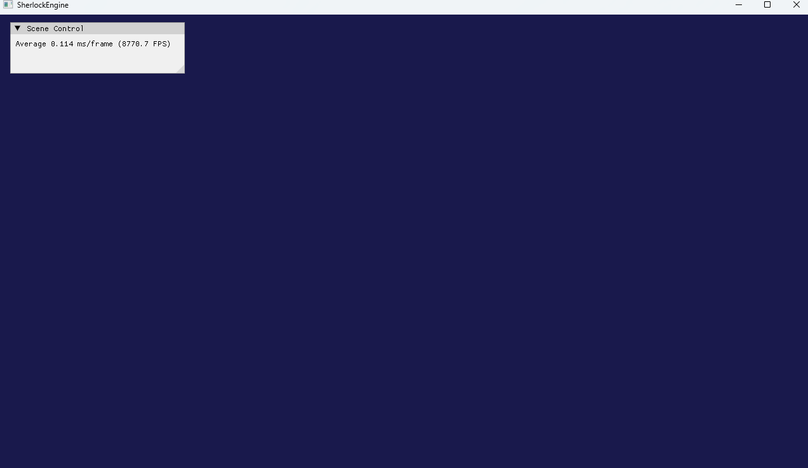

# 2026/07/01 작업내용

## 진행한 작업

- D3D11 장치들을 초기화하고 관리하는 Device클래스 구현
- AppBase클래스와 AppBase를 상속받은 TestApp클래스 구현
- 기존 Main에서 관리하던 메시지 루프를 AppBase로 이전

## 문제 / 이슈

- 없음

## 해결 내용

- 없음

## 다음 작업

- Rendering관련 작업을 담당하는 Render클래스 구현 후 삼각형 띄워보기