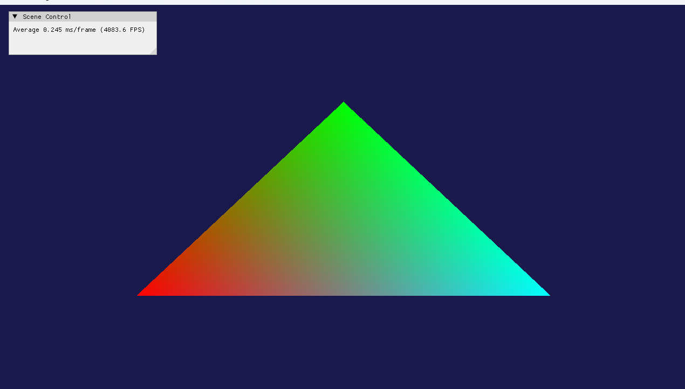

# 2026/07/01 작업내용

## 진행한 작업

- Shader클래스를 구현.
- Shader, Renderer, 그리고 Device클래스를 통해 화면에 삼각형 그리기.

## 문제 / 이슈

- Mesh나 MeshRenderer등의 클래스로 기능을 분할하지 않아 Shader, Renderer, Device에서 서로를 참조하는 구조가 형성
- 추후에 클래스 분리와 구조 수정등으로 다듬기.

## 해결 내용

- 없음

## 다음 작업

- 화면에 구 띄우기.