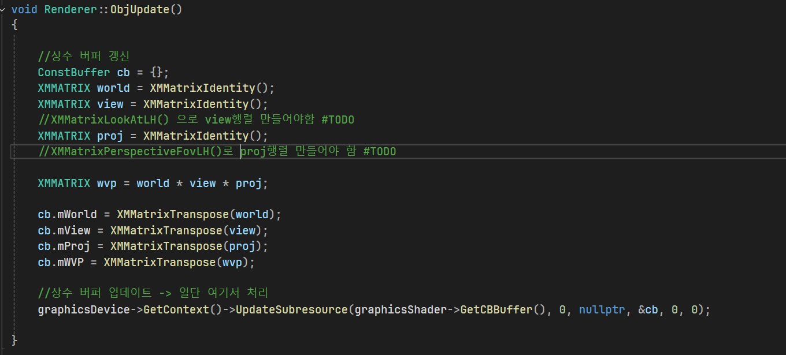
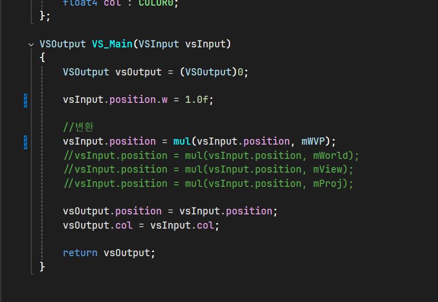

# 2026/07/06 작업내용

## 진행한 작업

- TestApp::Render() 흐름 변경
    - shaderClass.ShaderUpdate();
    - renderer.RenderModeUpdate();
    - renderer.Render();

-  매 프레임 렌더링을 하기 전에 Vertex Shader / Pixel Shader 재바인딩-> VS 상수버퍼 바인딩 -> RasterizerState 재바인딩 -> Renderer::Render()에서 VertexBuffer / InputLayout / PrimitiveTopology / Draw를 수행하도록 바꾸면서 셰이더와 렌더 설정이 매 프레임 보장되도록 변경.

- D3D Debug Layer사용 설정

-WVP행렬을 Renderer클래스에서 상수 버퍼에 업데이트, VertexShader에서 행렬을 업데이트하는 로직

## 문제 / 이슈

- 
- 

## 해결 내용

- 

## 다음 작업

- Camera와 Transform추가 준비